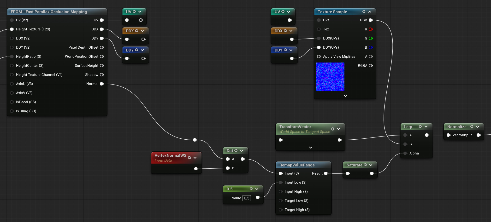
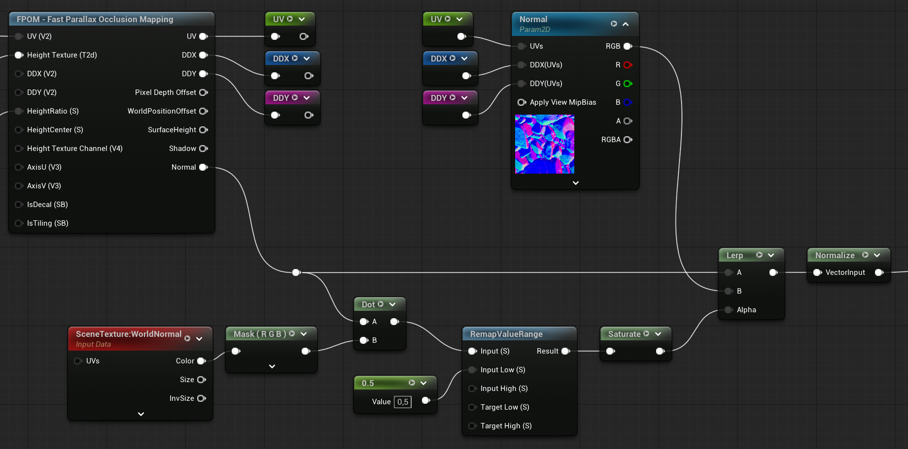

# Combined Normals

You can combine normals to use the derived normals where the projection is steep (side of things) and the normal texture for detail where the projection is flat (top of things).
This produces an overall better result than using either normal alone.

> [!WARNING] Decals
> Combining normals is slightly different for surface and decal materials.

> [!INFO] Detailed Normals
> Combining normals is only for when you have two normals describing "the same thing". 
> 
> If you have a detailed normal texture then use BlendAngleCorrectedNormals node as you would with a standard Normal texture sample.

## Surface materials

### Setup (Surface materials)

> [!WARNING] Tangent Space
> The Normal output is in World Space. So remember to use a Transform node to convert it to Tanget Space if you material uses Tangent Normals.

The image above shows how to combine them.

1. Do a dot product to get a mask telling us if the current pixel is flat or at an angle.
2. We remap the value to make it a bit more aggressive
3. Transform the normal before lerping if the material uses tangent space normals.
4. Normalize the output before plugging it into the material Normal output.

## Decal materials

### Setup (Decal materials)

The image above shows how to combine them. 

The setup is the same as with surface materials except that we compare against the WorldNormal scene texture instead of the Vertex Normal. We also don't need to do any transforms.

1. Do a dot product to get a mask telling us if the current pixel is flat or at an angle.
2. We remap the value to make it a bit more aggressive
3. Normalize the output before plugging it into the material Normal output.