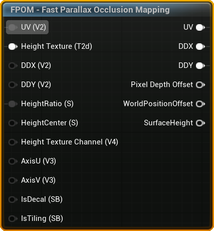
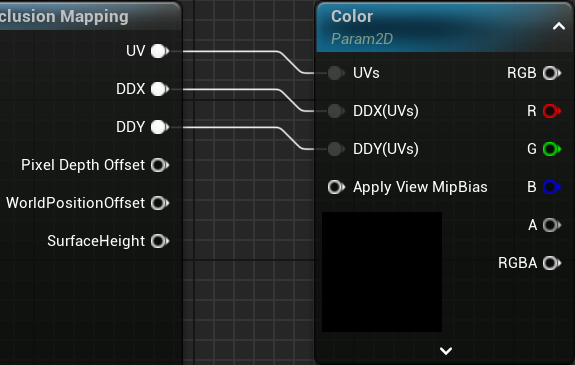

## Inputs

### UV

- Type: `UV`
- Default: `Texture Coordinate of UV 0`

### Height Texture

- Type: `Texture Object` (Required)
- Note: For packed textures use the `Height Texture Channel` pin to set which channel holds the height texture

### DDX

- Type: `float2`
- Default: `ddx(UV)`
- Note: UV/DDX/DDY needs to be in sync. Use `FPOM - UV Derivatives Debug Helper` to debug if the projection looks wrong.

### DDY

- Type: `float2`
- Default: `ddy(UV)`
- Note: UV/DDX/DDY needs to be in sync. Use `FPOM - UV Derivatives Debug Helper` to debug if the projection looks wrong.

### HeightRatio

- Type: `float`
- Default: `0.08`

### HeightCenter

- Type: `float`
- Default: `0.5`
- Options: Value from `0` to `1`. 

`0` means the parallax starts at the surface and grows down, `1` means it starts at the surface and grows up. `0.5` means the growth is evenly split up and down.

### Height Texture Channel

- Type: `float4`
- Default: `1,0,0,0`

A channel mask (for example `(1, 0, 0, 0)` for red) selecting which channel of the heightmap texture holds the height data. Use this when the height is packed into a spare channel of an existing texture.

### IsDecal

- Type: `Static Bool`
- Default: `false`

A static bool signaling if the function is used on a decal.

### IsTiling

- Type: `Static Bool`
- Default: `true`

A static bool signaling if the height texture lookup should wrap or clamp. This value is always `false` if `IsDecal` is true.

### Advanced

#### AxisU

#### AxisV

## Outputs

> [!WARNING] UV/DDX/DDY
> It's important to always hook up UV, DDX and DDY to ensure correct MIP sampling and Anisotropic Filtering

### UV

- Type: `UV`

### DDX & DDY

- Type: `float2`

Set `MipValueMode` on your Texture Samples to `Derivative` to enable the DDX/DDY inputs.

### Optional

#### Pixel Depth Offset

- Type: `float`
- Note: Virtual Shadow Maps tends to self-shadow incorrectly when PDO is used.

Used to set PDO in the material output to make the surface look more 3D when intersecting with other objects.

#### WorldPosition Offset

- Type: `float3`

Used to offset the world position when using FPOM on a RVT landscape.

#### SurfaceHeight

- Type: `float`
- Returns: `0` (bottom) to `1` (top)

Used to drive effects like fake AO in holes, water, etc.